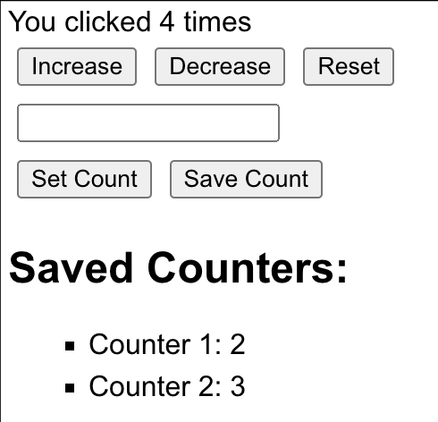

# Coding Dojo: Counter App
This is project that can be reimplemented as a code dojo 



The idea, is to make the candidate build a react project from scratch, e.g. using 
```
npx create-react-app counter-app 
```
or using another fork of this repo where the actual code is removed

# Possible tasks
First task is to create a simple counter (button "increase" which show the result).
Other tasks can be:

1. **Decrease Button**: Add a button that decreases the count by 1 when clicked.
2. **Reset Button**: Add a button that resets the count to 0 when clicked.
3. **Input Field**: Add an input field where users can enter a number. When they click a "Set Count" button, the count should be set to the number they entered.
4. **Error Handling**: If the user tries to set the count to a non-number or a negative number, show an error message.
5. **Save Count**: Add a button that saves the current count to a list. Display this list on the page.
6. **Local Storage**: Use the localStorage API to persist the count and the list of saved counts. When the user refreshes the page, the count and the list should not be lost.
7. **Styling**: Use CSS or a CSS-in-JS library to style your components and improve the layout of your application.
8. **Testing**: Write unit tests for your components using a library like React Testing Library.

# Prerequisites
1. node js
2. yarn or npm

# Setup to starting doing the dojo
```
git clone https://github.com/PCPS/react-dojo.git
git checkout skeleton
yarn install or npm install
yarn start or npm start
```

# Setup to see proposed solution
```
git clone https://github.com/PCPS/react-dojo.git
yarn install or npm install
yarn start or npm start
```

Happy coding! 👨‍💻
